# terraform-gcp-bigquery

A production-ready Terraform module for managing Google BigQuery datasets, tables, views, materialized views, external tables, routines, row-level security, and data transfer configurations.

## Architecture

```mermaid
flowchart TD
    A[Terraform Module] --> B[BigQuery Dataset]
    B --> C[Native Tables]
    B --> D[Views]
    B --> E[Materialized Views]
    B --> F[External Tables]
    B --> G[Routines]
    B --> H[Data Transfers]
    C --> I[Time Partitioning]
    C --> J[Range Partitioning]
    C --> K[Clustering]
    C --> L[CMEK Encryption]
    B --> M[Access Control]
    M --> N[IAM Roles]
    M --> O[Authorized Views]
    M --> P[Row-Level Security]
    F --> Q[GCS Sources]
    F --> R[Google Sheets]
    G --> S[UDFs]
    G --> T[Stored Procedures]

    style A fill:#4285F4,stroke:#1A73E8,color:#FFFFFF
    style B fill:#34A853,stroke:#1E8E3E,color:#FFFFFF
    style C fill:#EA4335,stroke:#D93025,color:#FFFFFF
    style D fill:#EA4335,stroke:#D93025,color:#FFFFFF
    style E fill:#EA4335,stroke:#D93025,color:#FFFFFF
    style F fill:#EA4335,stroke:#D93025,color:#FFFFFF
    style G fill:#FF6D00,stroke:#E65100,color:#FFFFFF
    style H fill:#FF6D00,stroke:#E65100,color:#FFFFFF
    style I fill:#9C27B0,stroke:#7B1FA2,color:#FFFFFF
    style J fill:#9C27B0,stroke:#7B1FA2,color:#FFFFFF
    style K fill:#9C27B0,stroke:#7B1FA2,color:#FFFFFF
    style L fill:#607D8B,stroke:#455A64,color:#FFFFFF
    style M fill:#00BCD4,stroke:#0097A7,color:#FFFFFF
    style N fill:#81C784,stroke:#66BB6A,color:#000000
    style O fill:#81C784,stroke:#66BB6A,color:#000000
    style P fill:#81C784,stroke:#66BB6A,color:#000000
    style Q fill:#FBBC04,stroke:#F9AB00,color:#000000
    style R fill:#FBBC04,stroke:#F9AB00,color:#000000
    style S fill:#E91E63,stroke:#C2185B,color:#FFFFFF
    style T fill:#E91E63,stroke:#C2185B,color:#FFFFFF
```



## Features

- **Dataset Management**: Full lifecycle with configurable expiration, time travel, and encryption
- **Native Tables**: Time/range partitioning, clustering, per-table CMEK encryption
- **Views**: Standard SQL views with legacy SQL option
- **Materialized Views**: Auto-refreshing materialized views with configurable intervals
- **External Tables**: CSV, JSON, Avro, Parquet, Google Sheets data sources
- **Routines**: User-defined functions (SQL/JavaScript) and stored procedures
- **Row-Level Security**: Fine-grained row-level access policies
- **Data Transfer**: Scheduled queries and data transfer configurations
- **Access Control**: Dataset-level IAM, authorized views

## Usage

### Basic

```hcl
module "bigquery" {
  source = "path/to/terraform-gcp-bigquery"

  project_id  = "my-project"
  dataset_id  = "my_dataset"
  location    = "US"
  description = "My analytics dataset"
}
```

### With Tables

```hcl
module "bigquery" {
  source = "path/to/terraform-gcp-bigquery"

  project_id  = "my-project"
  dataset_id  = "analytics"
  location    = "US"

  tables = {
    events = {
      schema = file("schemas/events.json")
      time_partitioning = {
        type  = "DAY"
        field = "event_timestamp"
      }
      clustering = ["user_id", "event_type"]
    }
  }
}
```

## Requirements

| Name | Version |
|------|---------|
| terraform | >= 1.3 |
| google | >= 5.0 |
| google-beta | >= 5.0 |

## Inputs

| Name | Description | Type | Default | Required |
|------|-------------|------|---------|----------|
| project_id | The GCP project ID | `string` | n/a | yes |
| dataset_id | The dataset ID | `string` | n/a | yes |
| location | Geographic location | `string` | `"US"` | no |
| friendly_name | Display name | `string` | `""` | no |
| description | Dataset description | `string` | `""` | no |
| default_table_expiration_ms | Default table expiration | `number` | `null` | no |
| delete_contents_on_destroy | Delete tables on destroy | `bool` | `false` | no |
| max_time_travel_hours | Time travel window (48-168) | `number` | `168` | no |
| labels | Labels map | `map(string)` | `{}` | no |
| default_encryption_configuration | KMS key for default encryption | `string` | `null` | no |
| tables | Native table definitions | `map(object)` | `{}` | no |
| views | View definitions | `map(object)` | `{}` | no |
| materialized_views | Materialized view definitions | `map(object)` | `{}` | no |
| external_tables | External table definitions | `map(object)` | `{}` | no |
| routines | Routine (UDF/procedure) definitions | `map(object)` | `{}` | no |
| access | Dataset access control list | `list(object)` | `[]` | no |
| authorized_views | Authorized view access | `list(object)` | `[]` | no |
| data_transfer_configs | Data transfer configurations | `map(object)` | `{}` | no |

## Outputs

| Name | Description |
|------|-------------|
| dataset_id | The dataset ID |
| dataset_self_link | The URI of the dataset |
| dataset_project | The project containing the dataset |
| dataset_location | The geographic location |
| table_ids | Map of table IDs to self links |
| view_ids | Map of view IDs to self links |
| materialized_view_ids | Map of materialized view IDs to self links |
| external_table_ids | Map of external table IDs to self links |
| routine_ids | Map of routine IDs |
| transfer_config_names | Map of data transfer config names |

## Examples

- [Basic](examples/basic/) - Simple dataset with a table
- [Advanced](examples/advanced/) - Dataset with partitioned tables, views, and IAM
- [Complete](examples/complete/) - Full configuration with all resource types

## License

MIT License - Copyright (c) 2024 kogunlowo123
